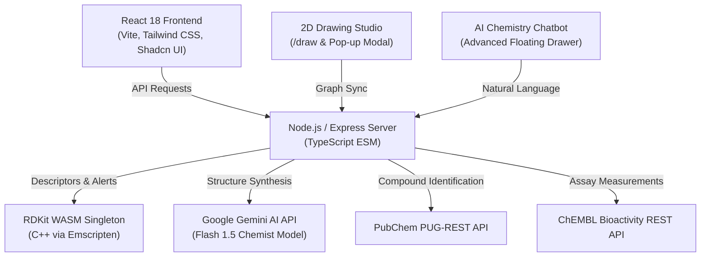

# BioPredict Safety 🧬🔬

[](https://github.com/Himanshu-Sharma12)
[](https://github.com/Himanshu-Sharma12/BioActivity-Prediction)
[](https://www.typescriptlang.org/)
[](https://react.dev/)
[](https://www.rdkit.org/)
[](https://deepmind.google/technologies/gemini/)
[](https://vitest.dev/)
[](LICENSE)

An enterprise-grade, deterministic cheminformatics and AI-powered molecular safety platform designed and developed by **Himanshu Sharma**. BioPredict Safety combines **RDKit WebAssembly**, **Google Gemini AI**, and live **ChEMBL / PubChem REST APIs** to provide real-time molecular structure sketching, physicochemical property calculation, structural alert screening (PAINS & Brenk), and comprehensive safety profiling for drug discovery and biochemical research.

---

## 🌟 Key Features

### 1. 🎨 2D Molecular Drawing Studio & Pop-out Tab (`/draw`)
- **Interactive SVG Canvas**: Sketch structures atom-by-atom with real-time valency tracking and coordinate normalization.
- **Dynamic Bond Multiplicity**: Seamlessly cycle through single (`—`), double (`=`), and triple (`≡`) bonds with click-and-drag rubber-band connections.
- **Scaffold Stamps & Functional Groups**: 1-click snapping for Benzene, Pyridine, Cyclohexane, Furan, Indole, and functional groups like `-OH`, `-COOH`, `-NH2`, `-NO2`, `-CF3`, and halogens.
- **Dedicated Widescreen Pop-out Studio**: Open `/draw` in a new browser tab with unlimited canvas space and real-time bidirectional parent-child tab synchronization via `window.opener.postMessage`.
- **AI Chemist Copilot**: Integrated Gemini AI assistant that designs molecules on demand (e.g. *"Design an ibuprofen analog"* or *"Add -OH to para position"*) and renders them directly onto the canvas.

### 2. 🤖 AI Chemistry & SMILES Chatbot Specialist
- Intelligent floating chemical assistant powered by Google Gemini AI.
- Translates natural language descriptions, IUPAC names, and medicine names into canonical SMILES strings.
- 1-click shortcuts to transfer structures directly into the 2D Drawing Studio or trigger an immediate bioactivity and safety assessment.
- Voice-enabled query input and pre-engineered scientific quick prompts.

### 3. ⚡ Deterministic Cheminformatics Engine (RDKit WASM)
- Computes exact physicochemical properties client- and server-side:
  - **Molecular Weight (MW)**
  - **Crippen Wildman LogP (cLogP)**
  - **Topological Polar Surface Area (TPSA)**
  - **Hydrogen Bond Donors & Acceptors (HBD / HBA)**
  - **Rotatable Bond Count & Ring Counts**
  - **Canonical SMILES, InChIKey, and Molecular Formula**
- Clean memory lifecycle with deterministic Emscripten WASM heap management.

### 4. 🛡️ Structural Alert & Safety Profiling
- **PAINS & Brenk Screening**: Screens against 31 curated substructure patterns from published literature (Brenk et al., *ChemMedChem* 2008; Baell & Holloway, *J. Med. Chem.* 2010).
- **Drug-Likeness Rules**: Evaluates Lipinski's Rule of 5 (1997) and Veber's Oral Bioavailability Rules (2002) with citation verification.
- **Safety Concern Stratification**: Low, Moderate, High, and Very High risk flags derived deterministically without black-box halluncinations.

### 5. 🌐 ChEMBL & PubChem Experimental Activity Integration
- Automatically retrieves verified target assays, $IC_{50}$, $EC_{50}$, $K_i$, and $K_d$ values from the official ChEMBL database.
- Queries PubChem PUG-REST for 2D and 3D conformer coordinates and compound synonyms.

### 6. 📊 Batch Processing & Export Studio (`/export`)
- High-throughput CSV, TXT, and SMI file parsing.
- Export comprehensive reports in CSV, PDF, and JSON formats for laboratory records and publication.

---

## 🏗️ System Architecture



---

## 🚀 Quick Start & Installation

### Prerequisites
- **Node.js** v18+ or v20+
- **npm** v9+
- *(Optional)* Google Gemini API key for AI synthesis features

### 1. Clone the Repository
```bash
git clone https://github.com/Himanshu-Sharma12/BioActivity-Prediction.git
cd BioActivity-Prediction
```

### 2. Install Dependencies
```bash
npm install
```

### 3. Configure Environment Variables
Copy the example environment configuration:
```bash
cp .env.example .env
```

Add your optional Google Gemini API key in `.env`:
```env
GEMINI_API_KEY=your_gemini_api_key_here
PORT=5001
```
*(The platform operates with full deterministic RDKit and ChEMBL functionality even without a Gemini API key).*

### 4. Run the Development Server
```bash
npm run dev
```
Open your browser at `http://localhost:5001`.

---

## 🧪 Testing & Validation

The codebase contains an exhaustive Vitest test suite ensuring deterministic calculation accuracy, schema validation, and rendering reliability:

```bash
# Run all unit and integration tests
npm test

# Run tests with watch mode
npm run test:watch

# Run TypeScript type check
npm run check
```

**Results:**
- `94 passed` (100% test passing rate across RDKit WASM, PubChem, Safety screening, and UI components).
- Zero TypeScript compiler diagnostics (`tsc` passes cleanly).

---

## 📁 Repository Structure

```
BioActivity-Prediction/
├── client/                     # Frontend Application
│   ├── index.html              # HTML Entry Point (Author: Himanshu Sharma)
│   └── src/
│       ├── components/         # Reusable UI & Cheminformatics Components
│       │   ├── advanced-chatbot.tsx     # Gemini AI Chemical Chatbot
│       │   ├── compound-input.tsx       # Multi-mode SMILES, Upload & Drawing Input
│       │   ├── molecular-sketcher.tsx   # 2D Canvas SVG Drawing Studio
│       │   ├── molecular-visualization.tsx # 2D/3D Molecule Viewers
│       │   ├── prediction-results.tsx   # Target Assays & Bioactivity Cards
│       │   ├── safety-assessment.tsx    # Structural Alerts & Rule of 5
│       │   ├── navbar.tsx               # Header Navigation & Theme Toggle
│       │   └── footer.tsx               # Footer with Author Attribution
│       ├── pages/              # Routed Views
│       │   ├── welcome.tsx              # Landing Page & Platform Overview
│       │   ├── dashboard.tsx            # Main Bioactivity Analysis Hub
│       │   ├── draw.tsx                 # Dedicated Widescreen Drawing Studio
│       │   ├── safety.tsx               # In-Depth Toxicology & Safety Profiling
│       │   ├── iot-analysis.tsx         # Drug Formulation & Label Analysis
│       │   └── export.tsx               # Report Generation Studio
│       ├── lib/                # Utility Functions & Query Client
│       └── index.css           # Modern Biotech Design System (Light & Dark)
├── server/                     # Backend API & Cheminformatics Services
│   ├── index.ts                # Express Server Bootstrapper
│   ├── routes.ts               # REST API Endpoints
│   ├── storage.ts              # In-Memory & Persistent Storage Abstraction
│   └── services/               # Core Scientific Logic
│       ├── rdkit.ts            # RDKit WebAssembly Singleton
│       ├── structural-alerts.ts # PAINS & Brenk 31-Pattern Engine
│       ├── safety.ts           # Lipinski & Veber Profile Assembler
│       ├── pubchem.ts          # PubChem REST Client & Structure Resolver
│       ├── chembl.ts           # ChEMBL REST Bioactivity Client
│       ├── gemini-chatbot.ts   # Gemini AI Chemical Synthesis Pipeline
│       └── molecular-canvas.ts # SVG Graph to SMILES Serialization
├── shared/
│   └── schema.ts               # Shared Zod Schemas & TypeScript Types
├── package.json                # Project Manifest & Metadata
├── tsconfig.json               # TypeScript Configuration
├── vite.config.ts              # Vite Frontend Configuration
└── vitest.config.ts            # Vitest Test Suite Configuration
```

---

## 📜 Research Disclaimer

BioPredict Safety is intended exclusively for research, computational screening, and academic investigation. The computed descriptors, structural alert screenings, and drug-likeness rules are physicochemical models and must not be used as clinical diagnostic criteria or sole determinants of human or animal toxicological safety.

---

## 👨‍💻 Author

**Himanshu Sharma**  
- **GitHub**: [@Himanshu-Sharma12](https://github.com/Himanshu-Sharma12)  
- **Repository**: [BioActivity-Prediction](https://github.com/Himanshu-Sharma12/BioActivity-Prediction)  

---

## 📄 License

This project is licensed  — see the [LICENSE](LICENSE) file for details.
